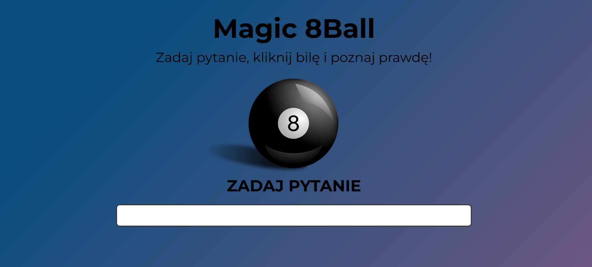

# 8Ball

    </img>

## Description

- Very small "one day made" app.
- The 8Ball will answer question that user asks. It will answer only when the sentence is ended with "?".
- I have created it to master and practice vanilla JavaScript.
- The 8Ball never lies! Trust me 😎

#### Technology used:
- HTML, CSS, JS
- SCSS

## What I Learned

- Using vanilla JavaScript in building mini-logic apps.

## Author info

- **Name:** Filip Bereszyński
- **Age:** 21 years old
- **Contact:**
    - bereszynski.filip@gmail.com
    - (+48) 510 240 074